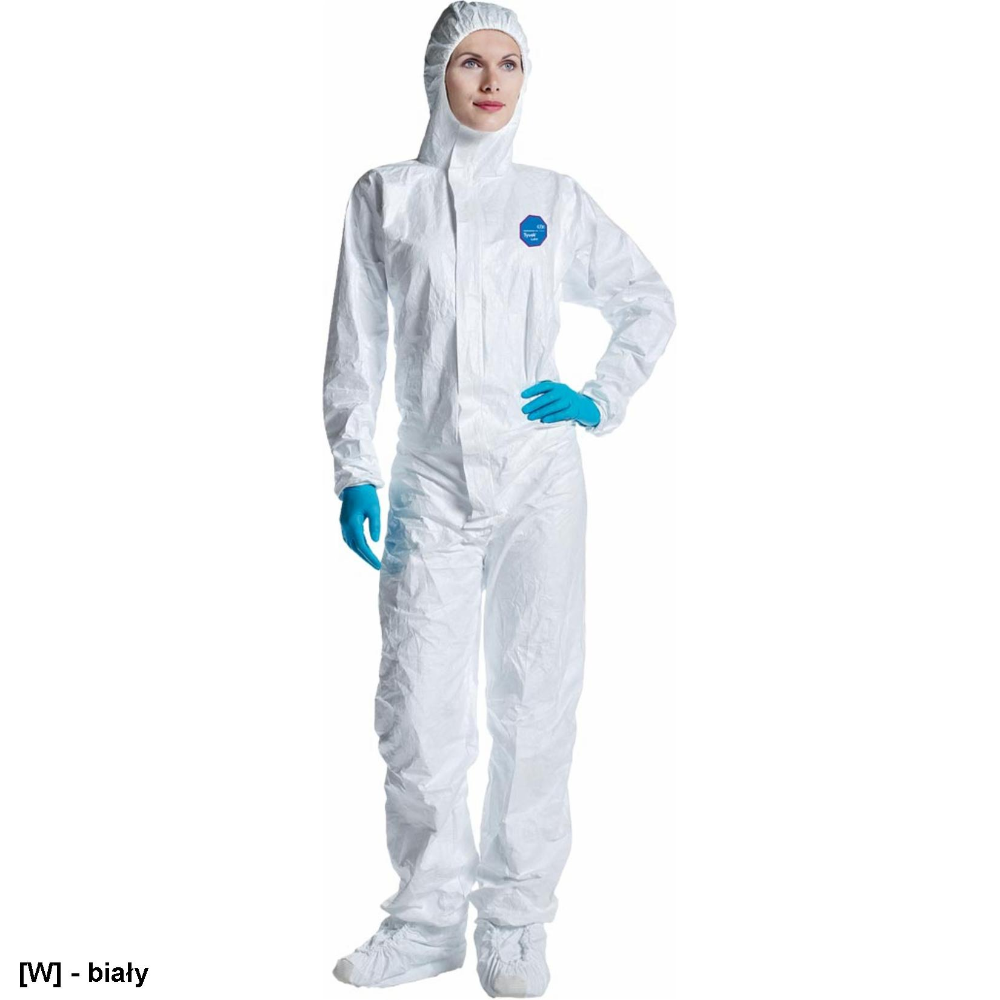
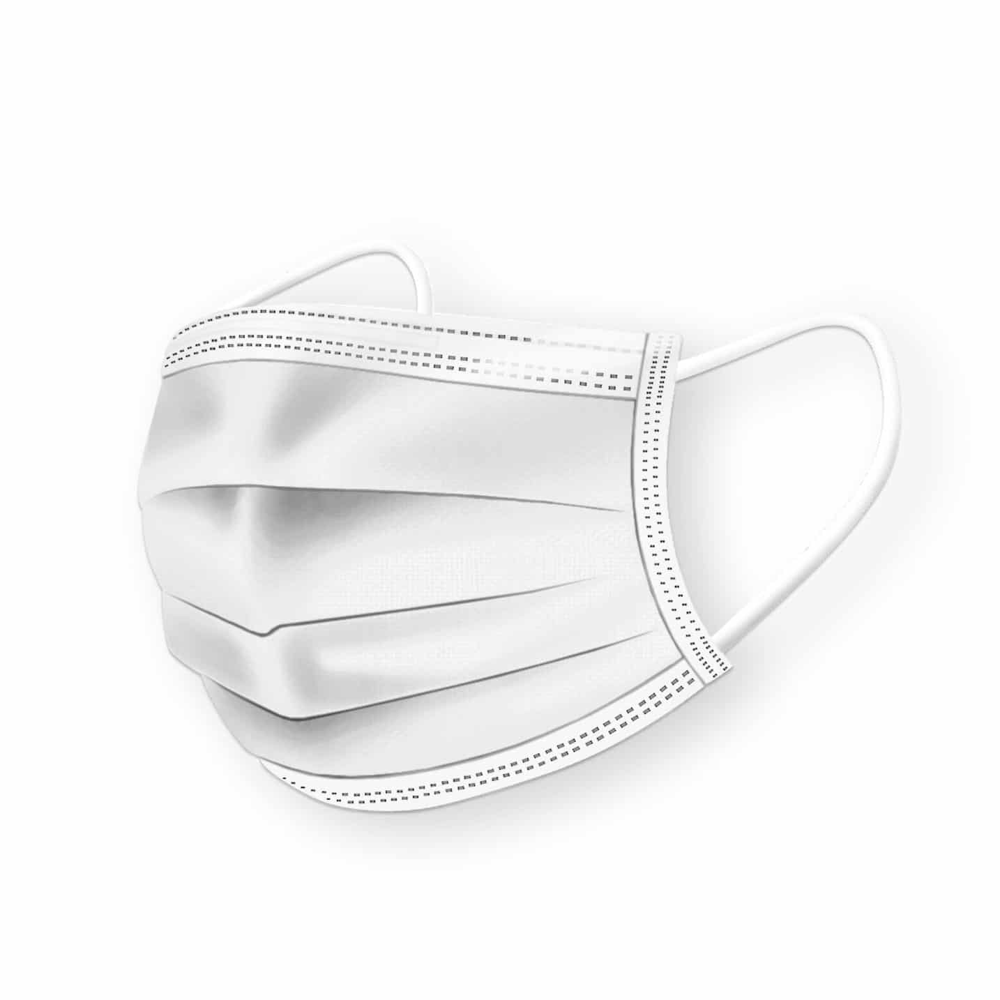

### Physiotherapist Protection Procedure:

### Starting work

The recommendations instructions

**1.1 Before starting work, the physiotherapist should protect themselves by:**
- a long-sleeved waterproof apron,
- safety goggles or a protective visor,
- medical disposable gloves. 
  - Class of protection: diagnostic examinations, surgical procedures, contact with irritant substances. 
  - Type of material: latex, nitrile, vinyl.
- Protective mask fitted tightly from the root of the nose to the chin. 

**1.2. Physiotherapist's obligations:**
- hand disinfection (according to standards or according to GIS recommendations for surgical washing),
- avoiding grouping of patients (especially during kinesitherapy or physiotherapy),
- using an individual approach with the physiotherapist. 

**1.3. Organisation of the physiotherapist's work:**
- avoid unnecessary transfers between departments,
- one physiotherapist-one workplace ( department, subdepartment),
- Systematic disinfection with alcohol-based products: mobile phones, pens, bed remotes and TV sets. 

>**IMPORTANT!**
>It is forbidden to reuse the same agents on the next patient (e.g. wet electrotherapy pads)!

**1.4. After finishing work (according to WHO):**
- remove personal protective equipment,
- perform hygienic hand disinfection,
- dispose of personal protective equipment in the red bag.

